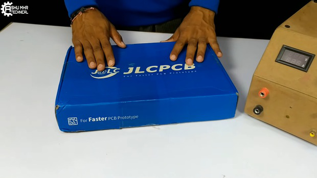

# DIY-Variable-Power-Supply
A variable power supply is an essential tool for any electronics
enthusiast or maker. It allows you to easily adjust the voltage and
current output to power and test different electronic circuits. In this
tutorial, we will show you how to build your own variable power supply
using the UC723 IC, TIP41 transistor, and 2N3055 transistor. This power
supply can output a voltage range of 1.2-30V and a current range of
0-10A.

**Supplies:**

> UC723 IC\
> TIP41 transistor\
> 2N3055 transistor\
> 7805 voltage regulator\
> Potentiometers for voltage and current adjustment\
> Capacitors\
> Resistors\
> PCB board.
> Wires and connectors

**Step 1: Get Your PCB Ready!**

> After designing the circuit, it is important to transform it into a
> PCB design to produce a physical version of the circuit.

There are many PCB suppliers available, but for this project we have
chosen as the best and cheapest PCBprovider. To order the PCB from , you
will need to follow a few simple steps. First, visit the website
andupload the Gerber file for your circuit design. You can then choose
the PCB specifications, such as the size, thickness, and number of
layers. Next, choose the quantity and any additional options, such as
silk screen printing or solder mask. Finally, proceed to checkout and
pay for your order. The PCB will be manufactured and shipped to you
within a few days.

Once you receive the PCB, you can start soldering the components onto it
to complete your power supply. As shown in the pictures, the PCB is
well-manufactured and includes all the labels and logos to guide you
during the soldering process. You can also download the Gerber file for
this circuit from the link provided in case you want to order the same
circuit design.

**Step 2: Circuit Design**

The UC723 IC is a pulse width modulator (PWM) control chip that is used
to control the output voltage and current of the power supply. The TIP41
transistor is used to amplify the current output and drive the load,
while the 2N3055 transistor is used to provide additional current
amplification. The 7805 voltage regulator is used to provide a stable 5V
supply for the UC723 IC.

To adjust the output voltage, we will use a potentiometer connected to
the control input of the UC723 IC. The output voltage of the power
supply is then determined by the duty cycle of the PWM signal generated
by the UC723.

To adjust the output current, we will use a second potentiometer
connected to the base of the TIP41 transistor. This adjusts the base
current of the transistor, which in turn adjusts the collector current
and the output current of the power supply.

**Step 3: Construction**

> First, you will need to assemble the circuit on the PCB board. Begin
> by soldering in the UC723 IC Base.

Next, you will need to solder in the rest of the components according to
your circuit design. This includes the resistors, capacitors,
potentiometers, and transistors. Be sure to double-check your
connections and make sure that everything is properly soldered in place.

**Step 4: Testing**

Once you have built the power supply, you can test it by connecting a
load to the output terminals and adjusting the voltage and current
potentiometers. Make sure to start at low voltages and gradually
increase the voltage and current to avoid damaging the circuit or the
load.

> Use the potentiometer to adjust the output voltage to the desired
> level. Use the panel meter to monitor the output voltage and current.
>
> That\'s it! With a little bit of soldering and some basic electronics
> skills, you should be able to build your own variable power supply
> using the UC723 voltage regulator..

**Note:** Make sure to use caution when handling high voltage and
current, as it can be dangerous if not handled properly. Always follow
proper safety guidelines and use protective equipment when working with
electronics.

> 
**Download Gerber** file from **HERE.**

**New users will also get some coupons while registering atvia this blue
link.**

**Conclusion:**

**Thank you for reading this guide, hopefully, this guide provides full
steps to help you to create your own\"DIY \"DIY**

**Variable Power Supply\"**. **If you have any questions please post
them in the comment section below. If you have any questions please post
them in the comment section below.**

